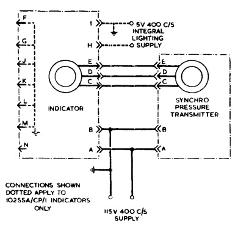
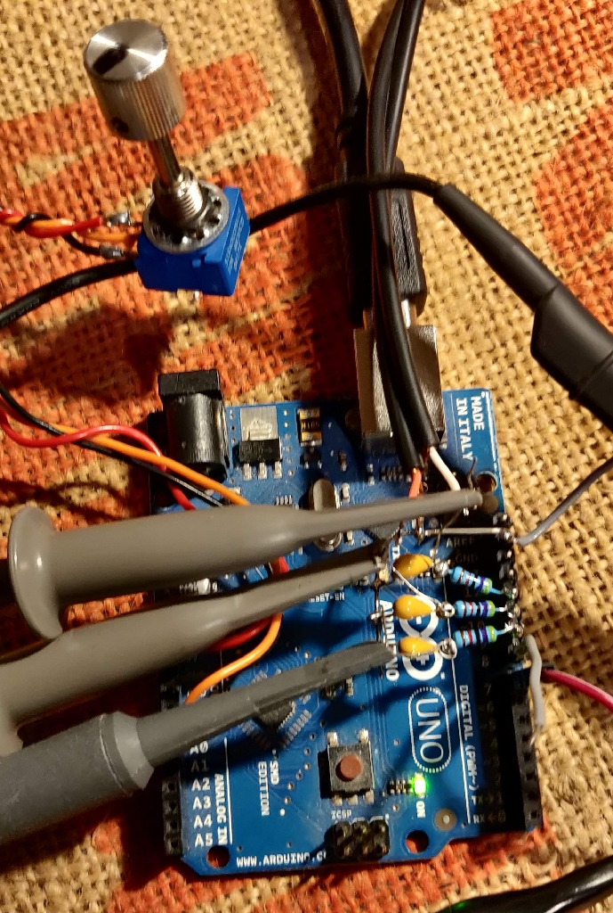

# Aviation_Synchro_Multiturn_Indicator
Aircraft pressure gauge, synchro repeater. 115V 400Hz power, 26V Synchro input

|Pin|Function   | |
|---|-----------|-|
|A  |165 R to B |Synchro R1, 115V 400Hz live|
|B  |Chassis Common  |SYnchro R2, 115v 400Hz return|
|C  |624R to D&E|Synchro S1 (26v)|
|D  |624R to C&E|Synchro S2 (26v)|
|E  |624R to C&D|Synchro S3 (26v)|
|F  |n/c||
|G  |n/c||
|H  |n/c||
|I  |n/c||
|J  |n/c||
|K  |n/c||
|L  |n/c||
|M  |n/c||
|N  |n/c||

[photos](./images/)

[Overhaul Manual](./documents/Overhaul-SynchroMultiturnIndicator.pdf)

[Youtube video](https://youtu.be/Hs32SN3N2VU)

[More instruments](https://github.com/DavidJRichards/Aviation_Instruments)

## Arduino sketch to drive indicator (WIP)

This arduino sketch generates three independant 400Hz sine waves to feed into an amplifier, the output is then fed into the indicator sysnchro. The output signals are PWM using 256 step approximation to sine waves.

A potentiometer is used to supply a variable DC voltage to the ADC0 input of the Arduino, this is used to provide the simulated shaft angle of the synchro generator. The shaft angle control varies the amplitude and polarity of the pwm sine waves to simulate a synchro transmitter.

A 26 V 400Hz reference signal is conditioned and fed into the Arduino to synchronise the generated waveforms to the excitation power used by the rest of the system. The input triggers an interrupt on the falling edge of this signal, this causes the internal counter used to index the sinewave PWN lookup to reset. The reset value is offset by an ammount to make the output phase coincide with power supply. 

The sine wave PWM outputs are filtered with 10K and 100n RC lowpass filter before being fed to a stereo power amplifier.

Two of the variable sinewave outputs are fed into the S1 and S2 synchro coils, the S3 coil is the common ground terminal of the amplifier. The third output is not used in the present design though could be fed to a third amplifier enabling true delta operation.

A 400 Hz square wave is available on Pin 8, this was tried as a sync output but abandoned in favor of receiving a sync signal from the power supply. however still useful to sync the scope.

The shaft position is derived from the analogue value read from a potentiometer connected between 0 and 5v on pin A0. the 0 to 1023 output is scaled to 0 to 360 degrees to drive the synchro simulator.

A three digit LED display is sued to show the current angle of rotation, the display based on a TM1651 and uses an arduino library [TM16xx LEDs and Buttons library](https://github.com/maxint-rd/TM16xx)

The full sketch is here and was built withte current Arduino IDE version 2.0.3 [Arduino synchro transmitter sketch](./pwm_synchro_transmit/pwm_synchro_transmit.ino)

The present version is the initial proof of concept design and will be expanded to include remote control using serial comms using Firmata protocol or something similar - maybee even port it onto ESP8266 or ESP32 for ethernet control.

