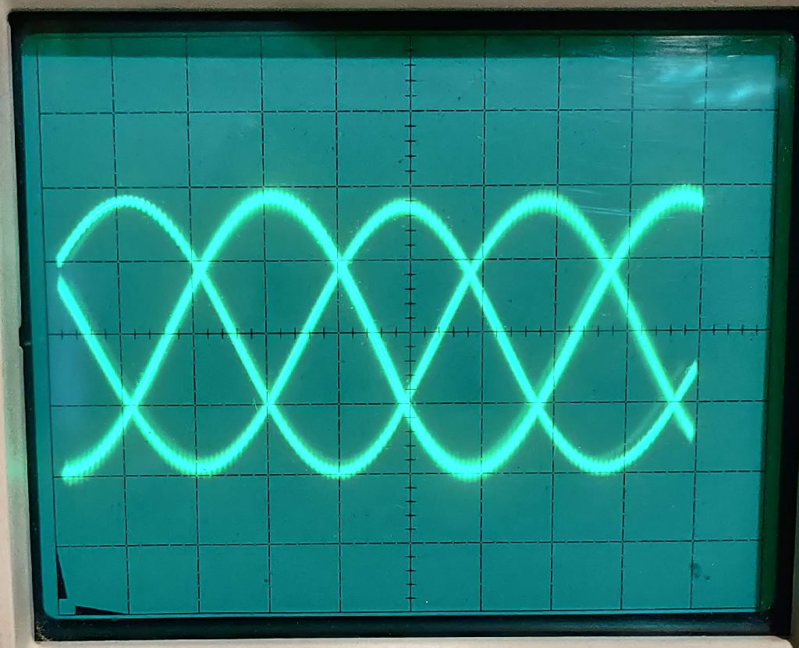

# Aviation_Synchro_Multiturn_Indicator
Aircraft pressure gauge, synchro repeater. 115V 400Hz power, 26V Synchro input

[photos](./images/)

[Overhaul Manual](./documents/Overhaul-SynchroMultiturnIndicator.pdf)

[Youtube video](https://youtu.be/Hs32SN3N2VU)

## Arduino sketch to drive indicator (WIP)

This arduino sketch generates three phase 400Hz sine waves to feed into an amplifier, the output is then fed into the indicator sysnchro.

The output signals are PWM using 256 step approximation to sine waves, each output is 120 degrees apart from each other.

A potentiometer is used to supply a variable DC voltage to the ADC0 input of the Arduino, this is sued to provide the simulated shaft angle of the synchro generator.

The shaft angle control varies the amplitude and polarity of the pwm sine waves to simulate a synchro transmitter.

Its not working quite right just yet. A means is neded to synchronise the main system 400Hz power supply to the sysnch simulation is needed, also I think there is still ascaling problem withthe output signals.

The sine wave PWM outputs are filtered with 47K and 100n RC lowpass filter before being fed to a stereo power amplifier.

Two of the variable sinewave outputs (120 degree apart) are fed into the S1 and S2 synchro coils, the S3 coil is the common ground terminal of the amplifier. The third output is not used.

A 400 Hz square wave is available on Pin 8 to synchronise the power supply (todo)

[Arduino synchro transmitter sketch](./pwm_synchro_transmit/pwm_synchro_transmit.ino)

